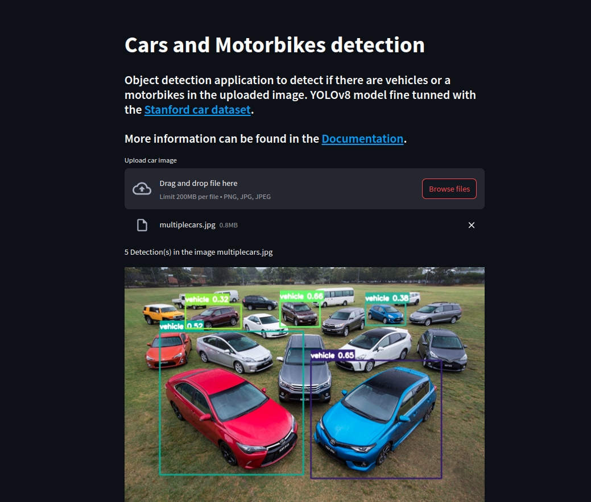

# 24-2-mlops-project-car_object_detection

Deploy a full Mlops Object detection Web application that detects cars and motobikes!

> [!NOTE]
> [Documentation](https://insper-classroom.github.io/24-2-mlops-project-car_object_detection/)
>

### Features:

- Download and preprocess the [Stanford Cars Dataset](https://universe.roboflow.com/openglpro/stanford_car/dataset/10).
- Data versioning with [DVC](https://dvc.org/).
- Train model with [YOLO](https://docs.ultralytics.com/) and export in [ONNX](https://onnx.ai/) format.
- [AWS API Gateway](https://aws.amazon.com/en/api-gateway/) is created using an [AWS Lambda function](https://docs.aws.amazon.com/lambda/latest/dg/welcome.html) inside an [AWS ECR](https://aws.amazon.com/en/ecr/) that make predictions using the trained model.
- AWS S3 Bucket used for storing Dataset versions and the model that will be used by the Lambda function.
- Documentation created using [Sphinx](https://www.sphinx-doc.org/en/master/) and deployed using [Github Pages](https://pages.github.com/).
- Web Application deployed using [Heroku](https://www.heroku.com/platform).
- Automated pipeline to deploy all the infrastructure to production using [Github Actions](https://github.com/features/actions).
- Local logging and also [CloudWatch](https://aws.amazon.com/pt/cloudwatch/) logging (for the lambda function).

