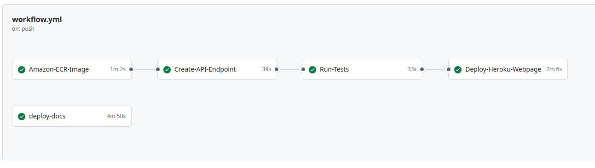
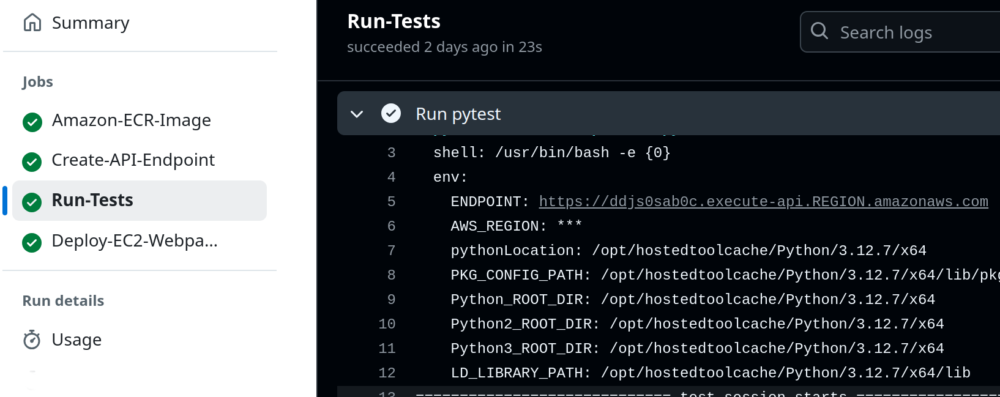
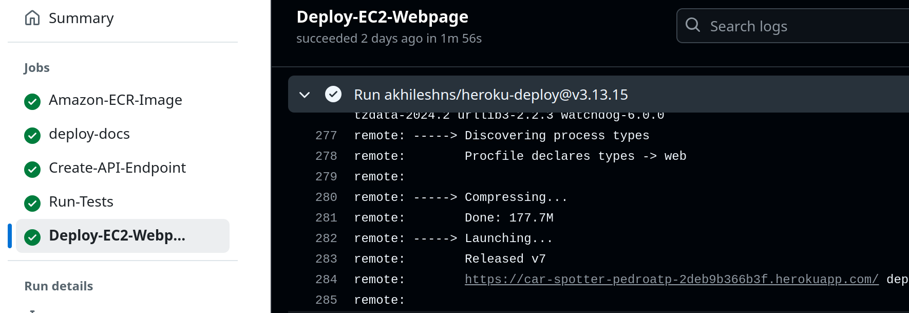

# Steps for deploying

To make your own deploy of the website, it is necessary do the following steps first:
- [Startup](./tutorial_startup.md)
- [steps for data versioning](./tutorial_data_versioning.md)
- [Steps for training](./tutorial_training.md)

1. After training, verify the logs from `logs\model_train` to make sure the model was properly saved in the S3 bucket.

2. Create a branch for the specific dataset version in use:

```Bash
git checkout -b branch-vA.B.C
```

3. Then, add the changes, commit and push branch to origin

```Bash
git add .

git commit -m "changes"

git push origin branch-vA.B.C
```

This will activate github workflow that will do all the necessary steps for a smoth deploy! Go to the section Actions in the repository webpage to see all the details from the workflow. To understand more about the CI/CD process for this project, see [scripts](./scripts.md).



Go to the job `Run-Tests` to find the API Endpoint. `REGION` is the `AWS_REGION` for secrets.



The URL for the heroku application can be found in:



The URL for the documentation will be a github page in your account.


After deploying you might want to see the logs from the lambda function. To do that, use the script "logs/see_logs_lambda.py"

```Bash
python3 logs/see_logs_lambda.py --lambda_name lambda-project-car-detection
```
