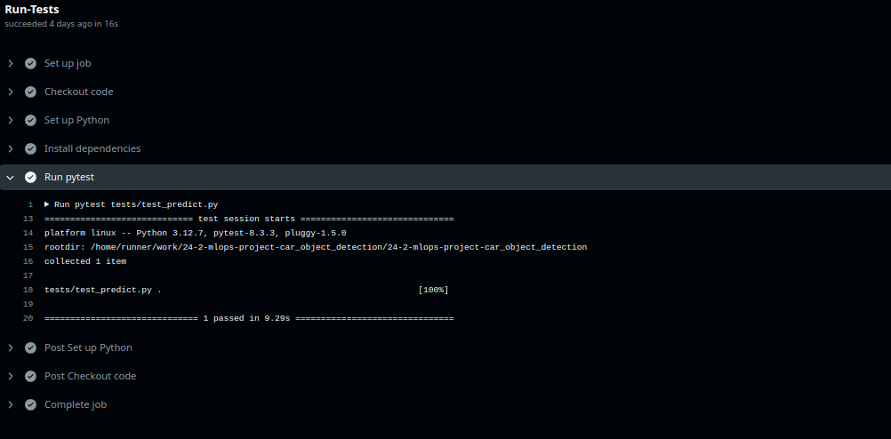

# Steps for deploying

It is necessary the following steps:
- ["steps for data versioning"](./tutorial_data_versioning.md)
- ["Startup"](./tutorial_startup.md)

For deploying the model do a git push to the main. Go to the section Actions in the repository to see all the details from the workflow


The API Endpoint can be found in:


The Github action also contains a job for testing the API with an Image of a car and it label.



After deploying you might want to see the logs from the lambda function. To do that, use the script "logs/see_logs_lambda.py"

```Bash
python3 logs/see_logs_lambda.py --lambda_name <lambda function name>
```
