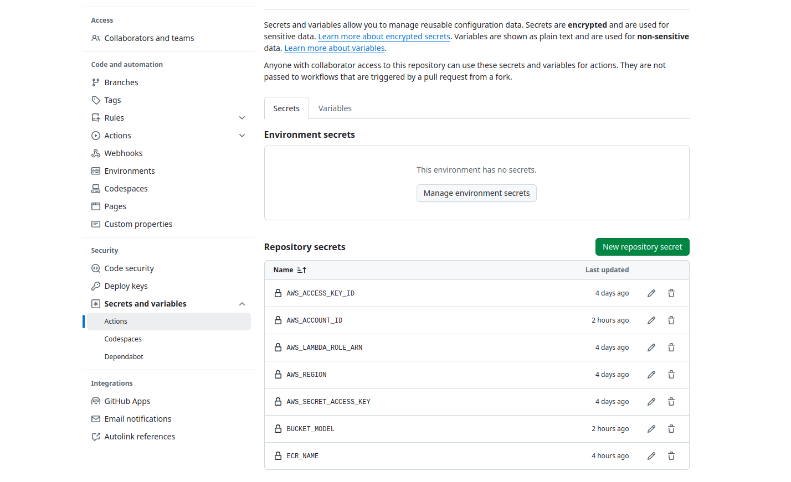

# Startup

This tutorial is necessary to startup the project. Here you will be able to create the S3 buckets that will be used to store data and the model file in the ONNX format.

1. Install all the requirements with:

```Bash
pip install -r requirements.txt
```

Ensure Python version 3.12 is being used

```{admonition} WARNING
:class: warning
If you would like to run with GPU, download CUDA Toolkit 12.6 [https://developer.nvidia.com/cuda-downloads](https://developer.nvidia.com/cuda-downloads)
```

2. Create .env file in the root of the repository

```Bash
ROBOFLOW_API_KEY=""
AWS_ACCESS_KEY_ID=""
AWS_SECRET_ACCESS_KEY=""
AWS_REGION=""
AWS_LAMBDA_ROLE_ARN=""
```

3. Create a S3 bucket one bucket to store the ONNX model and another one to store all the datasets from the data versioning

```Bash
python3 data/s3_bucket.py --bucket_model bucket-model-name --bucket_dataset bucket-dataset-name
```

This command will automatically save the bucket name in the .env file:

```Bash
BUCKET_MODEL="bucket-model-name"
BUCKET_DATASET="bucket-dataset-name"
```

4. Add the following variables in the "Actions secrets and variables" section at settings



```{admonition} INFO
:class: info
```ECR_NAME``` is the name of the ECR container.

```BUCKET_MODEL``` is the name of the bucket were the model is stored.
```