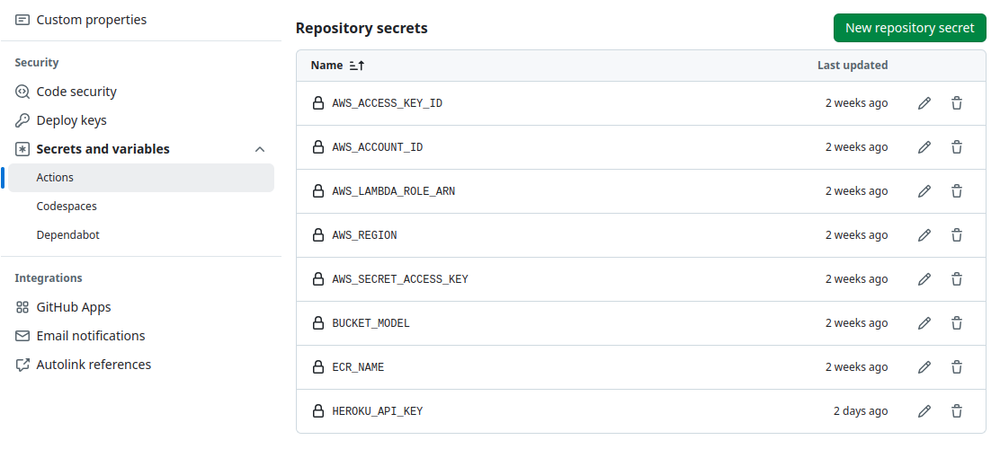
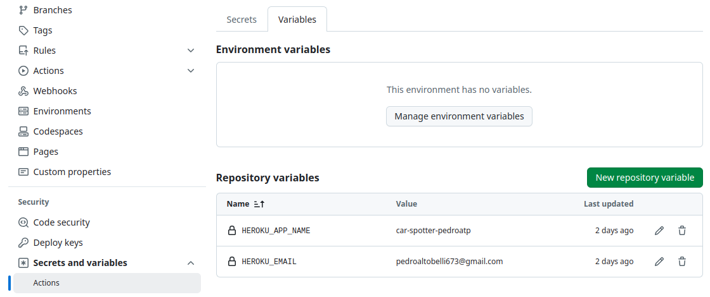

# Startup

This tutorial is necessary to run the repository with your own configurations.

1. Fork [24-2-mlops-project-car_object_detection](https://github.com/insper-classroom/24-2-mlops-project-car_object_detection), clone the repository and install all the requirements with:

```Bash
git clone https://github.com/fork-name

pip install -r requirements.txt
```

Ensure Python version 3.12 is being used

```{admonition} WARNING
:class: warning
If you would like to run with GPU, download CUDA Toolkit 12.6 [https://developer.nvidia.com/cuda-downloads](https://developer.nvidia.com/cuda-downloads)
```

2. Create .env file in the root of the repository

```Bash
ROBOFLOW_API_KEY=""
AWS_ACCESS_KEY_ID=""
AWS_SECRET_ACCESS_KEY=""
AWS_REGION=""
AWS_LAMBDA_ROLE_ARN=""
```

```{admonition} INFO
:class: info
- ```ROBOFLOW_API_KEY``` Roboflow API key to download dataset.

- ```AWS_ACCESS_KEY_ID``` AWS access key id.

- ```AWS_SECRET_ACCESS_KEY``` AWS secret access key.

- ```AWS_REGION``` AWS region.

- ```AWS_LAMBDA_ROLE_ARN``` AWS Lambda role ARN.

```

3. Create two S3 buckets. The first one will store the ONNX object detection model and the second one will store all the datasets from the data versioning.

```bash
python3 data/s3_bucket.py --bucket_model bucket-model-name --bucket_dataset bucket-dataset-name
```

This command will automatically save the bucket name in the .env file:

```Bash
BUCKET_MODEL="bucket-model-name"
BUCKET_DATASET="bucket-dataset-name"
```

4. Add the following secrets and variables in the "Actions secrets and variables" section at settings





```{admonition} INFO
:class: info
- ```AWS_ACCESS_KEY_ID``` AWS access key ID.

- ```AWS_SECRET_ACCESS_KEY``` AWS secret access key.

- ```AWS_REGION``` AWS region.

- ```AWS_LAMBDA_ROLE_ARN``` AWS Lambda role ARN.

- ```AWS_ACCOUNT_ID``` AWS account ID.

- ```BUCKET_MODEL``` is the name of the bucket were the model is stored.

- ```ECR_NAME``` is the name of the ECR container.

- ```HEROKU_API_KEY``` API key from Heroku. Necessary for deploying the website.

- ```HEROKU_APP_NAME``` NAme of the Heroku app.

- ```HEROKU_EMAIL``` Email of the Heroku
```

5. In the file ``app/setup.sh``, change to:

```Bash
#!/bin/bash

mkdir -p ~/.streamlit/

echo "\
[general]\n\
email = \"your-email.com\"\n\
" > ~/.streamlit/credentials.toml

echo "\
[server]\n\
headless = true\n\
enableCORS=false\n\
port = $PORT\n\
" > ~/.streamlit/config.toml
```